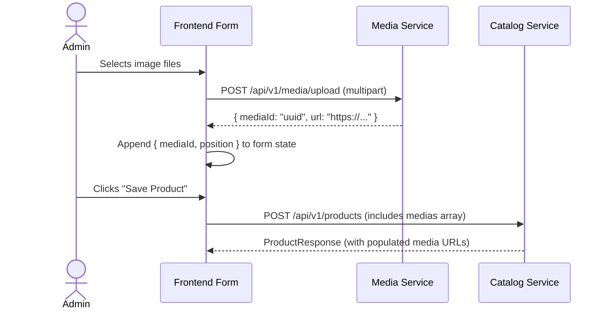

# Product API Contract & Frontend Integration Guide

This document defines the API contract for **Product Management (Create, Update, Read, Delete)** in the Catalog service. Frontend engineers can use this specification to design UI components, forms, state management, and API client types.

---

## Table of Contents
1. [Base Information](#base-information)
2. [Data Model & UI Form Architecture](#data-model--ui-form-architecture)
3. [TypeScript Interfaces](#typescript-interfaces)
4. [Create Product API](#1-create-product)
   - [Request Payload & Validation](#request-payload--validation)
   - [Example Create Request](#example-create-request-json)
   - [Example Create Response](#example-create-response-json)
5. [Update Product API](#2-update-product)
   - [Request Payload & Delta Rules](#request-payload--delta-rules)
   - [Example Update Request](#example-update-request-json)
   - [Example Update Response](#example-update-response-json)
6. [Get Product by ID (Edit Mode Prep)](#3-get-product-by-id)
7. [Error Handling & Validation Codes](#error-handling--validation-codes)
8. [Frontend Form & UI Recommendations](#frontend-form--ui-recommendations)

---

## Base Information

- **Base URL**: `/api/v1/products`
- **Standard Envelope Response**: All responses are wrapped in `ApiResponse<T>`:
  ```json
  {
    "status": "200",
    "message": "success",
    "data": { ... }
  }
  ```

---

## Data Model & UI Form Architecture

A Product is composed of 5 main sections:

```
┌─────────────────────────────────────────────────────────────────────────────┐
│                             Product Form (UI)                               │
├─────────────────────────────────────────────────────────────────────────────┤
│ 1. Basic & SEO Details  : name*, slug*, description, metaTitle, ...         │
│ 2. Classification       : categoryId, brandId                               │
│ 3. Media Gallery        : array of mediaId + position                       │
│ 4. Product Attributes   : array of { productAttributeId, value }            │
│ 5. Options & Variants   : options (e.g. Size, Color) + variants matrix (SKU)│
└─────────────────────────────────────────────────────────────────────────────┘
```

1. **Basic & SEO Information**: Name, auto-generated or custom slug, rich-text description, SEO metadata (`metaTitle`, `metaKeyword`, `metaDescription`).
2. **Classification**:
   - `brandId` *(optional)*: Single selection from Brand list.
   - `categoryId` *(optional)*: Single selection from Category tree. The backend automatically associates all parent categories up to the root.
3. **Medias**:
   - Upload file to Media service first $\rightarrow$ receive `mediaId` (UUID string).
   - Form submits array of `{ mediaId, position }`. The backend resolves public URLs on read.
4. **Attributes**:
   - Dynamic key-value pairs linked to predefined attributes (`productAttributeId`, `value`).
5. **Options & Variants**:
   - **Options**: Defines variation axes (e.g., Option 1: "Color", Option 2: "Size") and their available values.
   - **Variants**: Every product **MUST have at least 1 variant** (`@NotEmpty`). For products without variations, create 1 default variant.
   - **Variant Option Mapping**: The backend maps the $i$-th variant to the $i$-th value in each option list:
     - `options[0].values[i]` $\rightarrow$ Option 1 value for Variant $i$.
     - `options[1].values[i]` $\rightarrow$ Option 2 value for Variant $i$.

---

## TypeScript Interfaces

Copy and paste these interfaces directly into your frontend application (e.g., `src/types/product.ts`):

```typescript
// Standard API Envelope
export interface ApiResponse<T> {
  status: string;
  message: string;
  data: T;
}

// Media
export interface ProductMediaRequest {
  mediaId: string;
  position: number;
}

export interface ProductMediaResponse {
  mediaId: string;
  position: number;
  url: string | null;
  variantIds: number[];
}

// Option & Values (Create)
export interface ProductOptionValueCreateRequest {
  value: string;
  position: number;
}

export interface ProductOptionCombinationCreateRequest {
  productOptionId: number;
  position: number;
  values: ProductOptionValueCreateRequest[];
}

// Option & Values (Update)
export interface ProductOptionValueUpdateRequest {
  id?: number | null; // Provide ID if updating existing option value, omit/null for new
  value: string;
  position: number;
}

export interface ProductOptionCombinationUpdateRequest {
  productOptionId: number;
  position: number;
  values: ProductOptionValueUpdateRequest[];
}

// Option Responses
export interface ProductOptionValueResponse {
  id: number;
  value: string;
  position: number;
}

export interface ProductOptionCombinationResponse {
  productOptionId: number;
  name: string;
  position: number;
  values: ProductOptionValueResponse[];
}

// Attributes
export interface ProductAttributeValueRequest {
  productAttributeId: number;
  value: string;
}

export interface ProductAttributeValueResponse {
  productAttributeId: number;
  name: string;
  value: string;
}

// Variants
export interface ProductVariantCreateRequest {
  title?: string;
  sku: string;
  price: number;
  quantity: number;
  mediaId?: string;
}

export interface ProductVariantUpdateRequest {
  id?: number | null; // Provide ID if updating existing variant, omit/null for new
  title?: string;
  sku: string;
  price: number;
  quantity: number;
  mediaId?: string;
}

export interface ProductVariantResponse {
  id: number;
  title: string;
  productOptionValueIds: number[];
  sku: string;
  price: number;
  quantity: number;
}

// Brand
export interface BrandResponse {
  id: number;
  name: string;
  description: string;
  createdAt: string | null;
  updatedAt: string | null;
}

// Product Create Request
export interface ProductCreateRequest {
  name: string;
  description?: string;
  slug: string;
  metaTitle?: string;
  metaKeyword?: string;
  metaDescription?: string;
  categoryId?: number | null;
  brandId?: number | null;
  medias?: ProductMediaRequest[];
  options?: ProductOptionCombinationCreateRequest[];
  attributes?: ProductAttributeValueRequest[];
  variants: ProductVariantCreateRequest[]; // Required: At least 1 variant
}

// Product Update Request
export interface ProductUpdateRequest {
  name: string;
  description?: string;
  slug: string;
  metaTitle?: string;
  metaKeyword?: string;
  metaDescription?: string;
  categoryId?: number | null;
  brandId?: number | null;
  medias?: ProductMediaRequest[];
  options?: ProductOptionCombinationUpdateRequest[];
  attributes?: ProductAttributeValueRequest[];
  variants: ProductVariantUpdateRequest[]; // Required: At least 1 variant
}

// Full Product Response
export interface ProductResponse {
  id: number;
  name: string;
  description: string | null;
  slug: string;
  metaTitle: string | null;
  metaKeyword: string | null;
  metaDescription: string | null;
  brand: BrandResponse | null;
  medias: ProductMediaResponse[];
  attributes: ProductAttributeValueResponse[];
  options: ProductOptionCombinationResponse[];
  variants: ProductVariantResponse[];
  createdAt: string | null;
  updatedAt: string | null;
}
```

---

## 1. Create Product

### Endpoint
`POST /api/v1/products`

### Request Payload & Validation

| Field | Type | Required | Validation / Notes |
|---|---|---|---|
| `name` | `string` | **Yes** | `@NotBlank`, unique across all products |
| `slug` | `string` | **Yes** | `@NotBlank`, unique across all products (e.g. `nike-air-max-270`) |
| `description` | `string` | No | HTML / Markdown or plain text description |
| `metaTitle` | `string` | No | SEO meta title |
| `metaKeyword` | `string` | No | SEO keywords (comma separated) |
| `metaDescription` | `string` | No | SEO summary description |
| `categoryId` | `number` | No | Target Category ID (resolves hierarchy automatically) |
| `brandId` | `number` | No | Target Brand ID |
| `medias` | `array` | No | List of uploaded media items `{ mediaId, position }` |
| `options` | `array` | No | List of variation axes `{ productOptionId, position, values }` |
| `attributes` | `array` | No | Specifications `{ productAttributeId, value }` |
| `variants` | `array` | **Yes** | `@NotEmpty` (min 1). `{ sku, price, quantity, title? }` |

### Example Create Request JSON

```json
{
  "name": "Nike Air Max 270",
  "slug": "nike-air-max-270",
  "description": "<p>The Nike Air Max 270 delivers unmatched, all-day comfort.</p>",
  "metaTitle": "Buy Nike Air Max 270 Online",
  "metaKeyword": "nike, air max, shoes, running",
  "metaDescription": "Shop the latest Nike Air Max 270 with best prices.",
  "categoryId": 12,
  "brandId": 3,
  "medias": [
    {
      "mediaId": "9b1deb4d-3b7d-4bad-9bdd-2b0d7b3dcb6d",
      "position": 0
    },
    {
      "mediaId": "8c2efb5e-4c8e-4cae-acee-3c1e8c4eda7e",
      "position": 1
    }
  ],
  "options": [
    {
      "productOptionId": 1,
      "position": 0,
      "values": [
        { "value": "Black / White", "position": 0 },
        { "value": "Triple Red", "position": 1 }
      ]
    },
    {
      "productOptionId": 2,
      "position": 1,
      "values": [
        { "value": "US 9", "position": 0 },
        { "value": "US 10", "position": 1 }
      ]
    }
  ],
  "attributes": [
    {
      "productAttributeId": 101,
      "value": "Mesh & Synthetic"
    },
    {
      "productAttributeId": 102,
      "value": "Vietnam"
    }
  ],
  "variants": [
    {
      "title": "Black / White - US 9",
      "sku": "NK-AM270-BW-09",
      "price": 159.99,
      "quantity": 50,
      "mediaId": "9b1deb4d-3b7d-4bad-9bdd-2b0d7b3dcb6d"
    },
    {
      "title": "Triple Red - US 10",
      "sku": "NK-AM270-RED-10",
      "price": 169.99,
      "quantity": 30,
      "mediaId": "8c2efb5e-4c8e-4cae-acee-3c1e8c4eda7e"
    }
  ]
}
```

### Example Create Response JSON (HTTP 200)

```json
{
  "status": "200",
  "message": "success",
  "data": {
    "id": 45,
    "name": "Nike Air Max 270",
    "description": "<p>The Nike Air Max 270 delivers unmatched, all-day comfort.</p>",
    "slug": "nike-air-max-270",
    "metaTitle": "Buy Nike Air Max 270 Online",
    "metaKeyword": "nike, air max, shoes, running",
    "metaDescription": "Shop the latest Nike Air Max 270 with best prices.",
    "brand": {
      "id": 3,
      "name": "Nike",
      "description": "Sportswear and athletic equipment",
      "createdAt": "2026-08-01T10:00:00+07:00",
      "updatedAt": "2026-08-01T10:00:00+07:00"
    },
    "medias": [
      {
        "mediaId": "9b1deb4d-3b7d-4bad-9bdd-2b0d7b3dcb6d",
        "position": 0,
        "url": "https://cdn.example.com/images/nike-air-max-black.jpg",
        "variantIds": []
      },
      {
        "mediaId": "8c2efb5e-4c8e-4cae-acee-3c1e8c4eda7e",
        "position": 1,
        "url": "https://cdn.example.com/images/nike-air-max-red.jpg",
        "variantIds": []
      }
    ],
    "attributes": [
      {
        "productAttributeId": 101,
        "name": "Material",
        "value": "Mesh & Synthetic"
      },
      {
        "productAttributeId": 102,
        "name": "Origin",
        "value": "Vietnam"
      }
    ],
    "options": [
      {
        "productOptionId": 1,
        "name": "Color",
        "position": 0,
        "values": [
          {
            "id": 110,
            "value": "Black / White",
            "position": 0
          },
          {
            "id": 111,
            "value": "Triple Red",
            "position": 1
          }
        ]
      },
      {
        "productOptionId": 2,
        "name": "Size",
        "position": 1,
        "values": [
          {
            "id": 112,
            "value": "US 9",
            "position": 0
          },
          {
            "id": 113,
            "value": "US 10",
            "position": 1
          }
        ]
      }
    ],
    "variants": [
      {
        "id": 88,
        "title": "Black / White - US 9",
        "productOptionValueIds": [110, 112],
        "sku": "NK-AM270-BW-09",
        "price": 159.99,
        "quantity": 50
      },
      {
        "id": 89,
        "title": "Triple Red - US 10",
        "productOptionValueIds": [111, 113],
        "sku": "NK-AM270-RED-10",
        "price": 169.99,
        "quantity": 30
      }
    ],
    "createdAt": "2026-08-23T22:30:00+07:00",
    "updatedAt": "2026-08-23T22:30:00+07:00"
  }
}
```

---

## 2. Update Product

### Endpoint
`PUT /api/v1/products/{productId}`

### Request Payload & Delta Rules

1. **Entity Identification**:
   - For **existing variants**: include `"id": <variantId>`. The backend will update SKU, price, quantity, and title in-place.
   - For **newly added variants**: omit `"id"` or pass `null`. The backend will create a new variant record.
   - Any variant previously in DB whose `id` is not present in the `variants` array will be **deleted**.
2. **Option Values Identification**:
   - For existing option values, include `"id": <optionValueId>`.
   - For newly added option values, omit `"id"` or pass `null`.
   - Omitted option values / combinations are cleaned up automatically.
3. **Medias & Attributes**:
   - Medias are matched by `mediaId`. Any omitted `mediaId` is deleted.
   - Attributes are matched by `productAttributeId`. Any omitted attribute is removed.

### Example Update Request JSON

```json
{
  "name": "Nike Air Max 270 React (Updated)",
  "slug": "nike-air-max-270-react",
  "description": "<p>Updated product description with new specs.</p>",
  "metaTitle": "Buy Nike Air Max 270 React",
  "metaKeyword": "nike, air max, react, running",
  "metaDescription": "Special discount on Nike Air Max 270 React.",
  "categoryId": 15,
  "brandId": 3,
  "medias": [
    {
      "mediaId": "9b1deb4d-3b7d-4bad-9bdd-2b0d7b3dcb6d",
      "position": 0
    }
  ],
  "options": [
    {
      "productOptionId": 1,
      "position": 0,
      "values": [
        { "id": 110, "value": "Black / White", "position": 0 },
        { "value": "Triple Black", "position": 1 }
      ]
    },
    {
      "productOptionId": 2,
      "position": 1,
      "values": [
        { "id": 112, "value": "US 9", "position": 0 },
        { "value": "US 9.5", "position": 1 }
      ]
    }
  ],
  "attributes": [
    {
      "productAttributeId": 101,
      "value": "Flyknit & React Foam"
    }
  ],
  "variants": [
    {
      "id": 88,
      "title": "Black / White - US 9",
      "sku": "NK-AM270-BW-09",
      "price": 149.99,
      "quantity": 40
    },
    {
      "title": "Triple Black - US 9.5",
      "sku": "NK-AM270-TB-095",
      "price": 175.00,
      "quantity": 25
    }
  ]
}
```

### Example Update Response JSON (HTTP 200)

```json
{
  "status": "200",
  "message": "success",
  "data": {
    "id": 45,
    "name": "Nike Air Max 270 React (Updated)",
    "description": "<p>Updated product description with new specs.</p>",
    "slug": "nike-air-max-270-react",
    "metaTitle": "Buy Nike Air Max 270 React",
    "metaKeyword": "nike, air max, react, running",
    "metaDescription": "Special discount on Nike Air Max 270 React.",
    "brand": {
      "id": 3,
      "name": "Nike",
      "description": "Sportswear and athletic equipment",
      "createdAt": "2026-08-01T10:00:00+07:00",
      "updatedAt": "2026-08-01T10:00:00+07:00"
    },
    "medias": [
      {
        "mediaId": "9b1deb4d-3b7d-4bad-9bdd-2b0d7b3dcb6d",
        "position": 0,
        "url": "https://cdn.example.com/images/nike-air-max-black.jpg",
        "variantIds": []
      }
    ],
    "attributes": [
      {
        "productAttributeId": 101,
        "name": "Material",
        "value": "Flyknit & React Foam"
      }
    ],
    "options": [
      {
        "productOptionId": 1,
        "name": "Color",
        "position": 0,
        "values": [
          { "id": 110, "value": "Black / White", "position": 0 },
          { "id": 114, "value": "Triple Black", "position": 1 }
        ]
      },
      {
        "productOptionId": 2,
        "name": "Size",
        "position": 1,
        "values": [
          { "id": 112, "value": "US 9", "position": 0 },
          { "id": 115, "value": "US 9.5", "position": 1 }
        ]
      }
    ],
    "variants": [
      {
        "id": 88,
        "title": "Black / White - US 9",
        "productOptionValueIds": [110, 112],
        "sku": "NK-AM270-BW-09",
        "price": 149.99,
        "quantity": 40
      },
      {
        "id": 90,
        "title": "Triple Black - US 9.5",
        "productOptionValueIds": [114, 115],
        "sku": "NK-AM270-TB-095",
        "price": 175.00,
        "quantity": 25
      }
    ],
    "createdAt": "2026-08-23T22:30:00+07:00",
    "updatedAt": "2026-08-23T22:35:12+07:00"
  }
}
```

---

## 3. Get Product by ID

### Endpoint
`GET /api/v1/products/{productId}`

Use this endpoint when entering **Edit Product Mode** in the frontend to pre-fill the form fields. The response structure is identical to `ProductResponse`.

---

## Error Handling & Validation Codes

When an error occurs, the server responds with an error envelope:

```json
{
  "status": "400",
  "message": "Product already exists",
  "data": null
}
```

### Common Error Codes & UI Handling

| Status | Error Code / Message | Cause | Frontend Action |
|---|---|---|---|
| `400` | `PRODUCT_ALREADY_EXISTS` | A product with the given `name` or `slug` already exists. | Highlight `name` or `slug` input with error message: *"Product name or slug already in use"*. |
| `400` | `INVALID_PRODUCT` | A variant `id` in update request does not exist under this product. | Display generic notification and prompt user to refresh. |
| `400` | Validation Failures (`@NotBlank`, `@NotNull`, `@PositiveOrZero`) | Missing required fields or negative price/quantity. | Trigger client-side form validation before submitting. |
| `404` | `PRODUCT_NOT_FOUND` | `productId` not found. | Redirect to 404 or product list with alert toast. |
| `404` | `CATEGORY_NOT_FOUND` | Selected `categoryId` does not exist in DB. | Refresh category dropdown options. |
| `404` | `BRAND_NOT_FOUND` | Selected `brandId` does not exist in DB. | Refresh brand dropdown options. |
| `404` | `PRODUCT_OPTION_NOT_FOUND` | Selected `productOptionId` does not exist. | Refresh options catalog. |
| `404` | `PRODUCT_ATTRIBUTE_NOT_FOUND` | Selected `productAttributeId` does not exist. | Refresh attributes catalog. |

---

## Frontend Form & UI Recommendations

### 1. Slug Auto-generation
- In the Create form, automatically compute the `slug` from the `name` using standard kebab-case transformation (e.g. `lodash.kebabCase(name)`).
- Provide a "Lock / Unlock" toggle allowing manual slug editing if desired.

### 2. Single Product vs. Multi-Variant Form Toggle
- **Simple Product (No Variations)**:
  - Hide the Options builder section.
  - Automatically create 1 default variant behind the scenes:
    ```json
    "variants": [
      {
        "title": "Default Title",
        "sku": form.sku,
        "price": form.price,
        "quantity": form.quantity
      }
    ]
    ```
- **Configurable Product (With Variations)**:
  - Allow adding multiple options (e.g., Color, Size).
  - Generate a matrix table where the admin enters SKU, Price, and Quantity for each combination.

### 3. Media Upload Lifecycle

